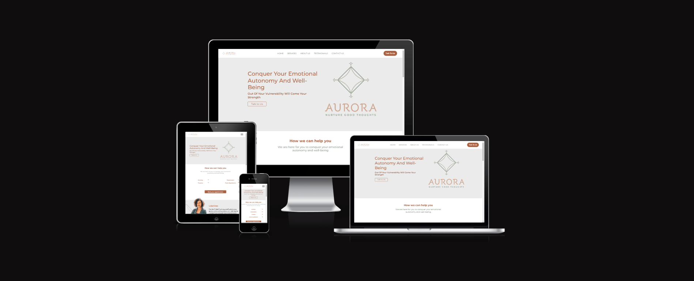

# **Aurora**
## **Site Overview**
​
Aurora is a mental health organization who focus on mental care for female clientele. The company is run by Luiza who has many years experience in her field and spotted a gap in the market for organizations who focus solely on female clients. The organization has a varied approach to the assessment and treatment of all forms of mental health issues and mental conditions. Care is tailored to the specific client and they do not use a one cure fixes all ailments approach.
​

​
## Table of contents:
- [**Aurora**](#aurora)
  - [**Site Overview**](#site-overview)
  - [Table of contents:](#table-of-contents)
  - [**Planning stage**](#planning-stage)
    - [**Target Audiences:**](#target-audiences)
    - [**User Stories:**](#user-stories)
    - [**Site Aims:**](#site-aims)
    - [**Wireframes:**](#wireframes)
    - [**Color Scheme:**](#color-scheme)
  - [**Typography**](#typography)
  - [**Current Features**](#current-features)
      - [*Navigation Bar:*](#navigation-bar)
      - [*Hero Section:*](#hero-section)
      - [*How we can help:*](#how-we-can-help)
      - [*About Us:*](#about-us)
      - [*Testimonials:*](#testimonials)
      - [*contact us:*](#contact-us)
      - [*footer:*](#footer)
  - [**Future-Enhancements**](#future-enhancements)
  - [**Testing Phase**](#testing-phase)
  - [**Bugs**](#bugs)
  - [**Deployment**](#deployment)
  - [**Tech**](#tech)
  - [**Credits**](#credits)
    - [**Honorable mentions**](#honorable-mentions)
    - [**Content:**](#content)
    - [**Media:**](#media)
## **Planning stage**
### **Target Audiences:**
​
* Users interested in mental health
* Users interested in finding help for mental issues
* Users interested in mental health organizations who treat female clients
* Women who need help to solve problems they can not solve on their own
​
### **User Stories:**
​
* As a user, I want to see the subject matter of the page.
* As a user, I want to navigate the page to find what I require quickly and easily.
* As a user, I want to learn more about what the business offers
* As a user, I want to reach out and contact the business
* As a user, I want the site to be usable on multiple devices
​
### **Site Aims:**
​
* To inform the user on services offered by the company
* To inform the user how to reach out and contact professionals
* To offer the user an opportunity to get in contact
* To offer the user a one stop place to find all the information they require to seek help​
​
### **Wireframes:**
​
Wireframes to come.
​
### **Color Scheme:**
​
For the page we decided on a orange (#A96142) and green theme (#637763) ecause they are calming colors and also match the company's branding in a complimentary way. Also the colors are slightly darker than the company branding to comply with WCAG contrast rules
​
## **Typography**
​
The site uses only one font, however, we use several different weights to convey importance of different visual elements.
The font used on the site is Montserrat from google fonts. Montserrat is a nice looking font that is easily readable, therefore making it a perfect choice for this project.
Font is linked in the credits section.

## **Current Features**
​
#### *Navigation Bar:*
​
* The user is given links to each section of the page
* Each option is presented in a way that is always obvious and readable
* on smaller screens a hamburger menu is provided to ensure mobile users have an optimal experience
​
#### *Hero Section:*

* Displays an eye catching header that informs the user what the page contains
* On larger screens, displays an alternate logo to the navigation bar
* Contains a call to action button that leads to the contact form

#### *How we can help:*

* A short section containing information about what the company offers
* 4 dropdown "accordions" that contain information on different ailments the company has dealt with
* Large call to action button leading to contact form

#### *About Us:*

* A carousel containing information about the staff in the company
* A large information section below the carousel with further information regarding mental illness
* A call to action button leading, yet again, to the contact form
* Carousel in this section does not display on mobile screens as it doesn't look quite right

#### *Testimonials:*

* A carousel containing comments left by past clients
* Displays message and name in separate styles
* Currently contains 3 comments

#### *contact us:*

* A contact section displaying an image and a contact form
* Contact form allows users to send an email to the company (Currently opens an email template that will email myself directly)
* On smaller screens the contact area is just the contact form as this looks better

#### *footer:*

* A small footer containing links to social media
* Contains a credit signature linking to developer's website (my github)
* On medium sized screens, also contains navigation links
​
## **Future-Enhancements**
​
A webpage is a living beast it's going to evolve past the initial stages of release generally, it's always good to discuss where you this the page may go in the future
​
* Using the technologies required for this project, I was unable to set up any back end for the contact form. In the future it would be nice to have the contact form build a formatted database to read information from for the company
* I'd also like to add an "accounts" feature to the site where users can sign in/sign up and store information regarding themselves.
* Add an appointment booking system in the accounts section
* Add google maps data to show where the company is located so clients can easily get directions
* Add a live chat for clients to contact the company easily and not have to wait for email communication
* Add more interactive elements to keep users engaged
​
## **Testing Phase**
​
Used friends and family with different devices to test the responsiveness of the site. Also tested the site on multiple different browsers and my own mobile device.
The site was run through a few validators to make sure it complies with accessibility guidelines. Most of the errors that get listed are from external libraries and not from the code I put in myself.​
Screenshots from validators to come.
More information to come.
​
## **Bugs**
​
* Issue - The carousel in the about us section sometimes drops down and behind the next part of the section
* Cause - Unknown. This is not in my code but in the code provided by Flickity.
* Resolution - Resizing the screen or refreshing the page seems to correct the error. There is no known fix I can perform without the use of more advanced technologies such as javascript, which is out of the scope of this project, sadly.
​
***
## **Deployment**
I deployed the page on GitHub pages via the following procedure: -
​
1. From the project's [repository](https://github.com/Zandirin/Aurora), go to the **Settings** tab.
2. From the left-hand menu, select the **Pages** tab.
3. Under the **Source** section, select the **Main** branch from the drop-down menu and click **Save**.
4. A message will be displayed to indicate a successful deployment to GitHub pages and provide the live link.
​
You  can find the live site via the following URL - [live webpage](https://zandirin.github.io/Aurora/)

***
​
## **Tech**

Technologies used in this project:
​
- HTML Programming language
- CSS Programming language
- Flickity JS and CSS libraries for carousels
- CodeAnywhere IDE for writing code
- Git for version control
- Github for page deployment
​
## **Credits**
### **Honorable mentions**
​
I'd like to give thanks to all the friends and family who helped with testing the page on all their different devices to make sure it performed correctly and looked good on all display types. I'd also like to thank my mentor Richard Wells for his help with pointers on where I can improve/fix my code and all the useful links he provided to me.
​
### **Content:**
​
[Montserrat font:](https://fonts.google.com/specimen/Montserrat?query=Montserrat)
[Flickity Framework:](https://flickity.metafizzy.co/)
  
### **Media:**
​
All images were either designed by myself (logos) or found on google images from random searches like "Business woman"